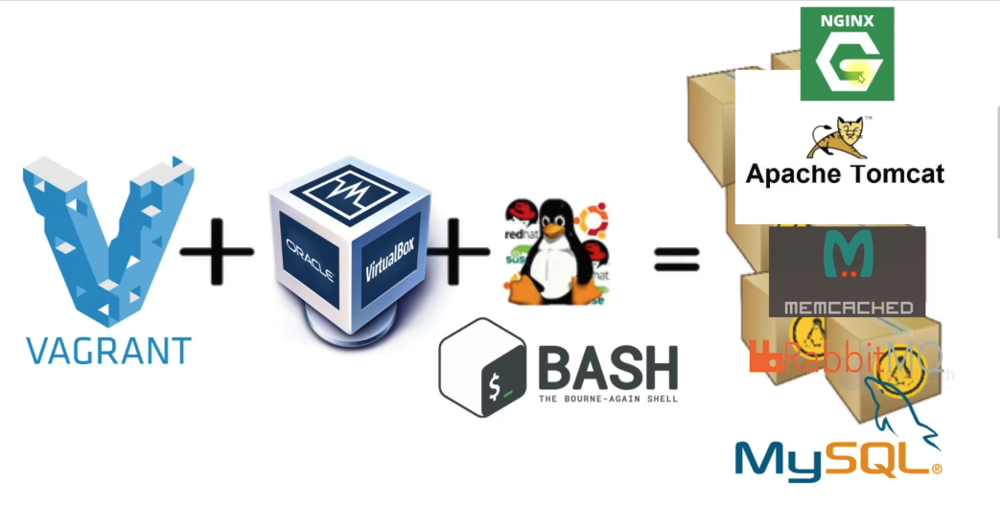
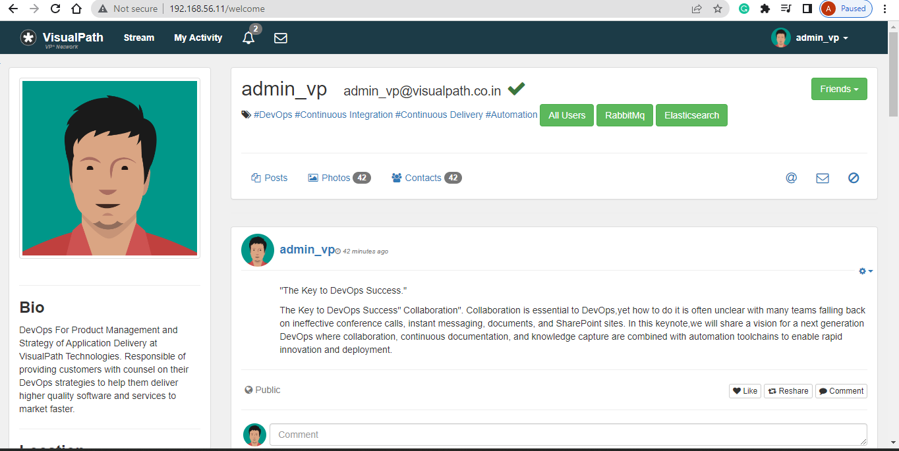

# Vprofile Project
## Manual Setup Of Multi-Tier Web Application, Locally.

[Project Source](https://github.com/Afeez-AA/vprofile-project.git)

Prerequisites
***
* Oracle VM Virtualbox
* JDK 1.8
* Vagrant
* GitBash
* Maven 3 
* MySQL 5.6



  
Technologies
***
* Spring MVC
* Spring Security
* Spring Data JPA
* Maven
* JSP
* MySQL

Flow Of Execution
***
1. Setup tools in the prerequisite above
2. Clone source code
3. cd into vagrant dir
4. Bring up Vm's
5. Validate


## Step1: VM Setup
* Clone the repository of the project to your machine
  ```sh
    git clone https://github.com/Afeez-AA/vprofile-project.git
  ```
* Checkout to the local-setup branch
  ```sh
   git checkout local-setup
  ```
* cd to the directory of the vagrant file setup
  ```sh
    cd vprofile-project/vagrant/Manual_provisioning
  ```

* Install vagrant plugins with the following commands
  ```sh
    vagrant plugin install vagrant-hostmanager
  ```
  ```sh
    vagrant plugin install vagrant-vbguest
  ```

* Now, we can bring up the machine
  ```sh
    vagrant up
  ```

* Verify the VM is now up
  

* We need to check the `/etc/hosts` file as this should have been updated since the plugin's were installed.
  ```sh
  cat /etc/hosts
  ```
  

* From web01, ping the other VM's to verify the connectivity
  ```sh
      ping app01
      ping rmq01
      ping mc01
      ping db01
  ```
  
## Step2: Service Provisioning 
* Note: We have 6 different services for our application
  1. Nginx: Web service
  2. Tomcat: Application server
  3. RabbitMQ: Broker/Queuing Agent
  4. Memcache: DB caching
  5. ElasticSearch: Indexing/serach service
  6. MySQL (MariaDB): SQL Database
  


* We'll be setting up our services in the order below;
  1. MySQL (MariaDB) (Database SVC)
  2. Memcache (DB Caching SVC)
  3. RabbitMQ  (Broker/Queue SVC)
  4. Tomcat (Application SVC)
  5. Nginx (Web SVC)
 
### Provisioning MySQL
* ssh to the `db01` machine
  ```sh
    vagrant ssh db01
  ```
* switch to the root user and update all packages
   ```sh
    sudo su -
    yum update -y
  ```

* then we need to enable EPEL, To enable EPEL ( Extra Packages for Enterprise Linux) respository, run the command below;
  ```sh
    yum install epel-release -y
  ```
* Set up db password using DATABASE_PASS environment variable and add it to `/etc/profile` file
  ```sh
    DATABASE_PASS='admin123'
  ```
* Make the above setup permanent by adding the variable above to the `/etc/profile` file
  ```sh
    vi /etc/profile
    source /etc/profile
  ```

* Now we can install git to enable us clone our source code and MariaDB Package 
  ```sh
    yum install git mariadb-server -y
  ```
* After the completion of the installation,then we can start, enable and check the status of the mariadb service.
   ```sh
    systemctl start mariadb
    systemctl enable mariadb
    systemctl status mariadb
  ```
  

* Run MySQL secure installation script
  ```sh
    mysql_secure_installation
  ```
* set the db password and other parameters as shown below
  
  
* validate the database connection
  ```sh
    mysql -u root -p
    exit
  ```
  

* Next, clone the source code the change the directory to get the `sql queries`
  ```sh
    git clone https://github.com/Afeez-AA/vprofile-project.git
    cd vprofile-project/src/main/resources
  ```
  

* Run the following commands to create a database `accounts`, user `admin` 
  ```sh
    mysql -u root -p"$DATABASE_PASS" -e "create database accounts"
    mysql -u root -p"$DATABASE_PASS" -e "grant all privileges on accounts.* TO 'admin'@'app01' identified by 'admin123' "
    cd ../../..
    mysql -u root -p"$DATABASE_PASS" accounts < src/main/resources/db_backup.sql
    mysql -u root -p"$DATABASE_PASS" -e "FLUSH PRIVILEGES"
  ```
* Verify if the SQL queries started a database with `role`,`user`, and `user_role` tables.
  ```sh
    mysql -u root -p"$DATABASE_PASS"
    MariaDB [(none)]> show databases;
    MariaDB [(none)]> use accounts;
    MariaDB [(none)]> show tables;
    exit
  ```
* We should restart our mariadb service for the changes to be effective and logout
  ```sh   
    systemctl restart mariadb
    logout
  ```
### Provisioning Memcache
* we'll login to memcached vm and switch to the root user
  ```sh
    vagrant ssh mc01
    sudo su -
  ```
* Update the OS and install EPEL repository (similar to the MySQL provisioning)
  ```sh
    yum update -y
    yum install epel-release -y
  ```
* Now, we'll install `memcached` package
  ```sh
    yum install memcached -y
  ```
* Similar to Mysql, let's start, enable and check the status of service
  ```sh
    systemctl start memcached
    systemctl enable memcached
    systemctl status memcache
  ```
    

* Run the command below to enable `memcached` service listen on TCP port `11211` and UDP port `11111`
   ```sh
    memcached -p 11211 -U 11111 -u memcached -d
  ```
* Validate if it is running on the right port
   ```sh
    ss -tunlp | grep 11211
  ```
  

* Good work!!!!!! You can exit from the server with the `exit` command.

### Provisioning RabbitMQ
* Lets login to RabbitMQ vm and switch to the root user
  ```sh
    vagrant ssh rmq01
    sudo su -
  ```
* Update the OS and dowload EPEL repository
   ```sh
    yum update -y
    yum install epel-release -y
  ```
* Before the installation of `RabbitMQ`, we need to install its dependencies first.
  ```sh
    yum install wget -y
    cd /tmp/
    wget http://packages.erlang-solutions.com/erlang-solutions-2.0-1.noarch.rpm
    sudo rpm -Uvh erlang-solutions-2.0-1.noarch.rpm
  ```
* Now Install RabbitMQ server. With command below, install the script and pipe with shell to execute the script.
  ```sh
    curl -s https://packagecloud.io/install/repositories/rabbitmq/rabbitmq-server/script.rpm.sh | sudo bash
    sudo yum install rabbitmq-server -y
  ```
* Lets start, enable and check the status of our RabbitMQ service.
  ```sh
    systemctl start rabbitmq-server
    systemctl enable rabbitmq-server
    systemctl status rabbitmq-server
  ```
  

* Create a `test` user with password `test`, then create a user_tag for test user as administrator. When completed, restart the rabbitmq service
  ```sh
    cd ~
    sh -c 'echo "[{rabbit, [{loopback_users, []}]}]." > /etc/rabbitmq/rabbitmq.config'
    rabbitmqctl add_user test test
    rabbitmqctl set_user_tags test administrator
    systemctl restart rabbitmq-server
  ```
* Check the service status to verify proper configuration.
  

* Good!!! You can exit with the `exit` command

### Provisioning Tomcat
* Login to the `app01` vm and switch to the root user
    ```sh
      vagrant ssh app01
      sudo su -
  ```
* Update the OS with the latest parches and dowload EPEL repository
  ```sh
      yum update -y
      yum install epel-release -y
  ```
* Install dependencies for the tomcat server
  ```sh
      yum install java-1.8.0-openjdk -y
      yum install git maven wget -y
  ```

* Now we can download Tomcat. First switch to /tmp/ directory.
   ```sh
    cd /tmp
    wget https://archive.apache.org/dist/tomcat/tomcat-8/v8.5.37/bin/apache-tomcat-8.5.37.tar.gz
    tar xzvf apache-tomcat-8.5.37.tar.gz
  ```
  
* Add tomcat user 
  ```sh
    useradd --home-dir /usr/local/tomcat8 --shell /sbin/nologin tomcat
  ```
* Copy our data to `/usr/local/tomcat8`
   ```sh
    cp -r /tmp/apache-tomcat-8.5.37/* /usr/local/tomcat8/ls /usr/local/tomcat8
  ```
* Change the ownership of files in `/usr/local/tomcat8/`
  ```sh
    ls -l /usr/local/tomcat8/
    chown -R tomcat.tomcat /usr/local/tomcat8
    ls -l /usr/local/tomcat8/
  ```
* Next we will setup systemd for tomcat
  ```sh
    vi /etc/systemd/system/tomcat.service
    Content to add tomcat.service file:
    [Unit]
    Description=Tomcat
    After=network.target

    [Service]
    User=tomcat
    WorkingDirectory=/usr/local/tomcat8
    Environment=JRE_HOME=/usr/lib/jvm/jre
    Environment=JAVA_HOME=/usr/lib/jvm/jre
    Environment=CATALINA_HOME=/usr/local/tomcat8
    Environment=CATALINE_BASE=/usr/local/tomcat8
    ExecStart=/usr/local/tomcat8/bin/catalina.sh run
    ExecStop=/usr/local/tomcat8/bin/shutdown.sh
    SyslogIdentifier=tomcat-%i

    [Install]
    WantedBy=multi-user.target
  ```
* Whenever a changes is made to `/etc/systemd/sytem/`, we need to always run the command below
  ```sh
    systemctl daemon-reload
  ```
* We can now start, enable and check the status of the tomcat service.
  ```sh
    systemctl start tomcat
    systemctl enable tomcat
    systemctl status tomcat
  ```
  

* Code Build and Deploy to Tomcat server
* We will clone our source code in the `/tmp` directory, the `cd` to the `vprofile-project` directory
  ```sh
    git clone https://github.com/rumeysakdogan/vprofile-project.git
    ls
    cd vprofile-project/
  ```
* Before we build our artifact, we need to update our configuration file that will be connect to our backend services db, memcached and rabbitmq service.
  ```sh
      vi src/main/resources/application.properties
  ```
  ```sh
    #JDBC Configutation for Database Connection
    jdbc.driverClassName=com.mysql.jdbc.Driver
    jdbc.url=jdbc:mysql://db01:3306/accounts?useUnicode=true&characterEncoding=UTF-8&zeroDateTimeBehavior=convertToNull
    jdbc.username=admin
    jdbc.password=admin123

    #Memcached Configuration For Active and StandBy Host
    #For Active Host
    memcached.active.host=mc01
    memcached.active.port=11211
    # For StandBy Host
    memcached.standBy.host=127.0.0.2
    memcached.standBy.port=11211

    #RabbitMq Configuration
    rabbitmq.address=rmq01
    rabbitmq.port=5672
    rabbitmq.username=test
    rabbitmq.password=test
  ```
* Run mvn install to build the artifact
  c target/
  ls

* Stop the tomcat service and remove the ROOT file so as to be replaced with the our artifact
  ```sh
    systemctl stop tomcat
    rm -rf /usr/local/tomcat8/webapps/ROOT
  ```
* Copy our artifact to the `/usr/local/tomcat8/webapps` directory as ROOT.war
  ```sh
    cp target/vprofile-v2.war /usr/local/tomcat8/webapps/ROOT.war
    systemctl start tomcat
  ```
Now time to provision the nginx server

### Provisioning Nginx 

* Update the OS (ubuntu)
  ```sh
      sudo apt update && sudo apt upgrade -y
  ```

* Install nginx
  ```sh
    sudo apt install nginx -y
  ```
* Lets create an nginx conf file in the `/etc/nginx/sites-available/vproapp` directory
    ```sh
    sudo vi /etc/nginx/sites-available/vproapp
  ```
* Add the content below
  ```sh
    upstream vproapp {
    server app01:8080;
    }
    server {
    listen 80;
    location / {
    proxy_pass http://vproapp;
    }
    }
  ```
* Remove the default nginx config file
   ```sh
    sudo rm -rf /etc/nginx/sites-enabled/default
  ```
* Create a symbolic link for our configuration file using default config location as below to enable our site. Then restart and enable nginx server.
  ```sh
    sudo ln -s /etc/nginx/sites-available/vproapp /etc/nginx/sites-enabled/vproapp
    sudo systemctl restart nginx
    sudo systemctl enable nginx
  ```
### STEP3: Validate Application from Browser
* From web01 server, run the `ifconfig` command to get the ip address for validation.
  ```sh
    ifconfig
  ```
  

* Nginx is running on browser using the ip address of the web01 server
  

* Validate Db connection using credentials admin_vp for both username and password.
* Validate app is running on the Tomcat server
   
* Validate RabbitMQ connection by clicking `RabbitMQ`
   
* Validate Memcache connection by clicking `AllUsers`
   
*  Validate data is coming from Database when user first time requests it.  
  
### STEP4: CleanUp
In our manual provisioning directory containing our vagrant file, run the command below to destroy all virtual machines.
  ```sh
    vagrant destroy
  ```