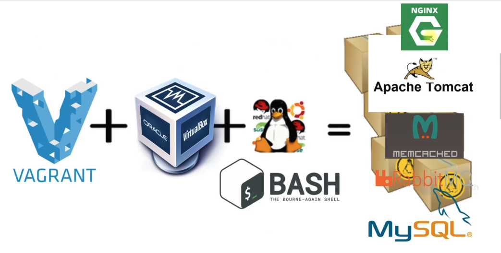

# Vprofile Project 02
## The Automated setup of a Multi-Tier Web Application locally


[Project Source](https://www.udemy.com/course/decodingdevops/)



Prerequisites
***
* Oracle VM VirtualBox Manager
* Vagrant
* Vagrant plugins
* Git
* IDE 
  
## Work Flow
* Prepare the bashscripts for each services
* Bring up the VM with the scripts
* Validate

### In [Project 1](../Project-1/README.md) , we provisioned our multi-tier web app manually, now we'll be automating the process.

### Below are the list of services we'll be preapring it's bash scripts;
1. MySQL (MariaDB): SQL Database
2. Memcache: DB caching
3. RabbitMQ: Broker/Queuing Agent
4. Tomcat: Application server
5.  Nginx: Web service

### Step1: Preparing the Bash Scripts for each VM
* Bash script for `MySQL` in `mysql.sh` file for our database server
    * [mysql.sh](../Project-2/scripts/mysql.sh)
* Bash script for `Memcache` in `memcache.sh` file for our memcache server 
     * [memcache.sh](../Project-2/scripts/memcache.sh)
* Bash script for `RabbitMQ` in `rabbitmq.sh` file for RabbitMQ server
    *  [rabbitmq.sh](../Project-2/scripts/rabbitmq.sh)
* Bash Script for `Application` in `tomcat.sh` file for the tomcat server
    * [tomcat.sh](../Project-2/scripts/tomcat.sh)
* Lastly, create a bash script to provision `Nginx server` which will forward requests to our backend application in `nginx.sh`
    * [nginx.sh](../Project-2/scripts/nginx.sh)

### Step2: Bring up the Virtual Mchines
* clone the repository 
```sh
        git clone https://github.com/Afeez-AA/vprofile-project.git
```

* Go to directory that our Vagrantfile exists and install the plugin before briging up the virtual machines.
```sh
    cd vprofile/profile-project/vagrant/Automated_provisioning
    vagrant plugin install vagrant-hostmanager
```

* After plugin installed, we can run below command to setup our VMs which will also bootstrap our servers for us.
```sh
    vagrant up
```

### Step3: Validate
* Validae the VM are up in he VBox


* We can validate the application using hostname given in Vagrantfile. Go to browser http://web01. Frontend is working successfully.


* Backend services also up/running.


* We can validate RabbitMq service.


* Next we can check our DB/Memcache services.


***Our application is working...Congratulations!!!***

### Step4: We can now destroy our VM's
* In the same vagrant file directory, run the following command to destroy the VM's.
```sh
    vagrant halt
    vagrant destroy
```
