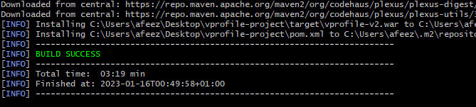
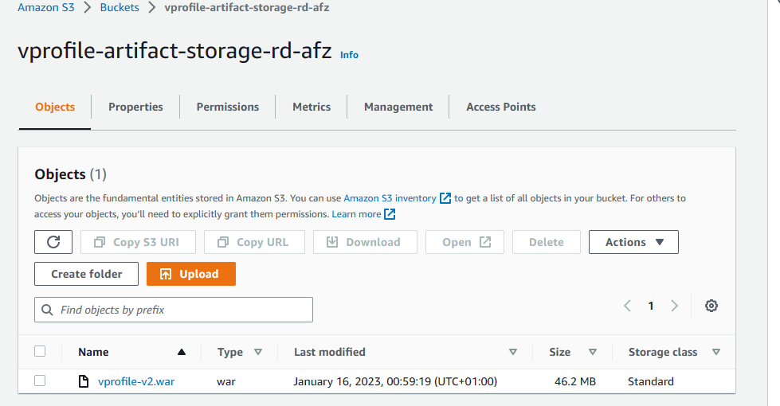
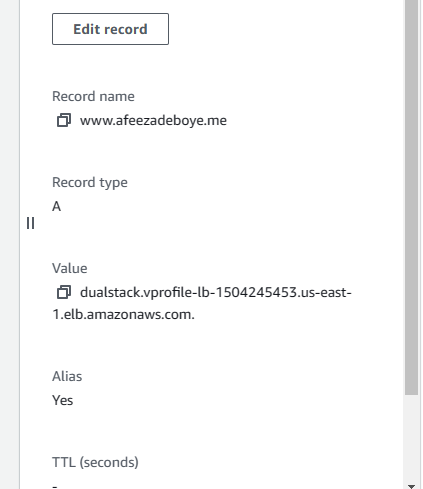

# Vprofile Project 03
## Lift and Shift Application Workflow to AWS

[Project Source](https://github.com/devopshydclub/vprofile-project/tree/aws-LiftAndShift)

Prerequisites:
* AWS Account 
* Maven
* JDK8
* AWS CLI

Project Architecture:


### Step-1: Create a security group for the services
  * create a security group named `vprofile-elb-sg` for our `land balancer` and configure `inbound rules` to allow port `80` and `443` from IPv4.
  
  * Create a security group `vprofile-app-SG` for our application server then allow port `22` and `8080` to accept connections from the security group above `vprofile-elb-sg` 
  
  * Now create the final security group named `vprofile-backend-sg` for our backend servers. This security group is for our application backend and hence we would be opening the following for each services respectively;
    * *MySQL* == `3306` 
    * *Memcached* == `11211`
    * *RabbitMQ* == `5672`
    * *ssh* == `22`
    * Save then edit the inbound rules allow `Alltraffic` from our own security group for the backend services to communicate with each other.
  

### Step-2: Create a keypair for our instances
   

### Step-3: Provision backend ec2 instances using userdata script
1. **DB INSTANCE**
   * Create a DB instance with the following details below;
    ```sh
      Name: vprofile-db01
      AMI: Centos 7
      InstanceType: t2.micro
      SG (Security Group): vprofile-backend-SG
    ```
    UserData: [mysql.sh](userdata/mysql.sh)

   * ssh into the instance to verify that the userdata script is executed
    ```sh
      sudo systemctl status mariadb
    ```
      

1. **MEMCACHED INSTANCE**
   * Create memcached instance with the details below;
    ```sh
      Name: vprofile-mc01
      AMI: Centos 7
      InstanceType: t2.micro
      SG: vprofile-backend-SG
    ```
    UserData: [memcache.sh](userdata/memcache.sh)

   * ssh into the instance and verify the service is running and listening on port 11211
    ```sh
      sudo systemctl status memcached.service
      sudo ss -tunpl | grep 11211
    ```
    

1. **RABBITMQ INSTANCE**
  * Create a rabbitmq instance with the details below;
    ```sh
      Name: vprofile-rmq01
      AMI: Centos 7
      InstanceType: t2.micro
      SG: vprofile-backend-SG
    ```
    UserData: [rabbitmq.sh](userdata/rabbitmq.sh)

  * You can now ssh into the instance and verify if the service is running
    ```sh
      sudo systemctl status rabbitmq-server
    ```
    

***Note: It may take some time to run userdata script after you connect to server. You can check the process ps -ef to see if the process start for service. If not wait sometime and check with systemctl status <service_name> command again.***

### Step-4: Create a Private Hosted Zone in Route53
* Now that our backend services are now running, lets updates the private IP's in Route53 DNS zone.
  * *db01* == `172.31.89.21` 
  * *mc01* == `172.31.81.3`
  * *rmq01* == `172.31.80.70`
* Create `vprofile.in`in `Private Hosted` zone using Route53 for our backend services. we will pick Default VPC in N.Virginia region. This recordso any changes would be used by our  `application.properties` file so whenever the public ip changes it won't affect our application.
  

### Step-5: Provision the application ec2 instances with userdata script
* Create the tomcat instance with the details below;
  ```sh
    Name: vprofile-app01
    AMI: Ubuntu 18.04
    InstanceType: t2.micro
    SG: vprofile-app-SG
  ```
  UserData: [tomcat_ubuntu.sh](userdata/tomcat_ubuntu.sh)

### Step-6: Create artifact locally with maven
* Clone the [project source repository](https://github.com/devopshydclub/vprofile-project/tree/aws-LiftAndShift)
* Make changes where necessary in `application.properties` fle under the `/src/main/resources` to the following below;
  ```sh
    jdbc.url=jdbc:mysql://db01.vprofile.in:3306/accounts?useUnicode=true&
    memcached.active.host=mc01.vprofile.in
    rabbitmq.address=rmq01.vprofile.in
  ```
* Go to the `vprofile-project` directory where the `pom.xml` file exits and execute the command below to create our artifact;
  ```sh
    mvn install
  ```
  

### Step-7: Create S3 bucket using AWS CLI to copy our artifact to the server on the cloud from the local machine
* Upload the artifact to the tomcat server through s3 bucket using the aws cli
* First, create an IAM user for authentication to be used from aws CLI
* configure our aws cli to use the iam user credentials
  ```sh
    aws configure
  ```
* Create bucket. The name must be unique because s3 is a global service in aws
  ```sh
    aws s3 mb s3://vprofile-artifact-storage-rd-afz
  ```
* Go to the artifact directory and run the command below to copy the artifact to the s3 bucket
  ```sh
    aws s3 cp vprofile-v2.war s3://vprofile-artifact-storage-rd-afz
  ```
* Verify the file is now in the bucket through the cli by running the command below;
  ```sh
    aws s3 ls vprofile-artifact-storage-rd-afz
  ```
* We can also verify from the management console
  

### Step-8: Download the artifact to the tomcat server from the s3 bucket
* To download our artifact onto Tomcat server, we need to create an IAM role for Tomcat. Once this role is created we will attach it to our app01 server.
  ```sh
    Type: EC2
    Name: vprofile-artifact-storage-role
    Policy: s3FullAccess
  ```
* Now attach the role to the ec2 `app01` instance.
* Before we login to our server, we need to add SSH access on port 22 to our vprofile-app-SG.
* Then connect to app01 Ubuntu server and verify if the service is running
  ```sh
    sudo systemctl status tomcat8
  ```
* stop the tomcat service and delete the `ROOT` file
  ```sh
    cd /var/lib/tomcat8/webapps/
    sudo systemctl stop tomcat8
    sudo rm -rf ROOT
  ```
* We need to install aws cli on our tomcat server so that we can dowload the artifact and make it our tomcat service `ROOT` file.
  ```sh
    sudo apt install awscli -y
    aws s3 ls s3://vprofile-artifact-storage-rd-afz
    aws s3 cp s3://vprofile-artifact-storage-rd-afz/vprofile-v2.war /tmp/vprofile-v2.war
    cd /tmp
    sudo cp vprofile-v2.war /var/lib/tomcat8/webapps/ROOT.war
    sudo systemctl start tomcat8
  ```

* verify application.properties file has the latest changes.
  ```sh
    sudo cat /var/lib/tomcat8/webapps/ROOT/WEB-INF/classes/application.properties
  ```

* We can validate network connectivity from server using telnet.
  ```sh
    sudo apt install telnet
    telnet db01.vprofile.in 3306
  ```

### Step-9: Setup our load balancer
* We need to create our `target group` before creating the load balancer.
  ```sh
    Intances
    Target Grp Name: vprofile-elb-TG
    protocol-port: HTTP:8080
    healtcheck path : /login
    Advanced health check settings
    Override: 8080
    Healthy threshold: 3
    available instance: app01 (Include as pending below)
  ```
* Now we will create our Load Balancer.
  ```sh
    profile-prod-elb
    Internet Facing
    Select all AZs
    SecGrp: vprofile-elb-secGrp
    Listeners: HTTP, HTTPS
    Select the certificate for HTTPS
  ```
### Step-10: Create Route53 record for ELB endpoint
* We will create an A record with alias to ALB so that we can use our domain name to reach our application.
  
* Validate our application using DNS.
   

### Step-11: Configure autoscaling group for application instances
* Create an AMI from the app instances
  
* Next we will create a Launch template using the AMI created in above step for our ASG.
  ```sh
    Name: vprofile-app-LT
    AMI: vprofile-app-image
    InstanceType: t2.micro
    IAM Profile: vprofile-artifact-storage-role
    SecGrp: vprofile-app-SG
    KeyPair: vprofile
  ```
* Launch template is ready, now we can create our ASG.
  ```sh
    Name: vprofile-app-ASG
    ELB healthcheck
    Add ELB
    Min:1
    Desired:2
    Max:4
    Target Tracking-CPU Utilization 50
  ```
* If we terminate any instances we will see ASG will create a new one using LT that we created.

This is useful whenever the app server fails its healthcheck due to numerous reasons.

We have come to the end of this project, see you in the next.

### Step-12: Clean-up
* Delete all resources we created to avoid any charges from AWS.