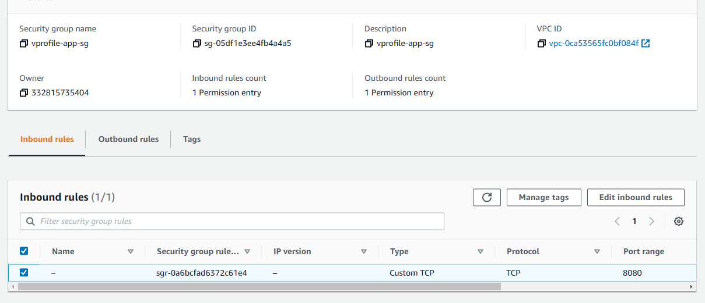

# Vprofile Project 03
## Lift and Shift Application Workflow to AWS

[Project Source](https://github.com/devopshydclub/vprofile-project/tree/aws-LiftAndShift)

Prerequisites:
* AWS Account 
* Maven
* JDK8
* AWS CLI

Project Architecture:


### Step1: Create a security group for the services
  * create a security group named `vprofile-elb-sg` for our `land balancer` and configure `inbound rules` to allow port `80` and `443` from IPv4.
  
  * Create a security group `vprofile-app-SG` for our application server then allow port `22` and `8080` to accept connections from the security group above `vprofile-elb-sg` 
  
  * Now create the final security group named `vprofile-backend-sg` for our backend servers. This security group is for our application backend and hence we would be opening the following for each services respectively;
    * *MySQL* == `3306` 
    * *Memcached* == `11211`
    * *RabbitMQ* == `5672`
    * *ssh* == `22`
    * Save then edit the inbound rules allow `Alltraffic` from our own security group for the backend services to communicate with each other.
  

### Step2: Create a keypair for our instances
   

### Step3: Provision backend ec2 instances using userdata script
1. **DB INSTANCE**
   * Create a DB instance with the following details below;
    ```sh
      Name: vprofile-db01
      AMI: Centos 7
      InstanceType: t2.micro
      SG (Security Group): vprofile-backend-SG
    ```
    UserData: [mysql.sh](userdata/mysql.sh)

   * ssh into the instance to verify that the userdata script is executed
    ```sh
      sudo systemctl status mariadb
    ```
      

1. **MEMCACHED INSTANCE**
   * Create memcached instance with the details below;
    ```sh
      Name: vprofile-mc01
      AMI: Centos 7
      InstanceType: t2.micro
      SG: vprofile-backend-SG
    ```
    UserData: [memcache.sh](userdata/memcache.sh)

   * ssh into the instance and verify the service is running and listening on port 11211
    ```sh
      sudo systemctl status memcached.service
      sudo ss -tunpl | grep 11211
    ```
    

1. **RABBITMQ INSTANCE**
  * Create a rabbitmq instance with the details below;
    ```sh
      Name: vprofile-rmq01
      AMI: Centos 7
      InstanceType: t2.micro
      SG: vprofile-backend-SG
    ```
    UserData: [rabbitmq.sh](userdata/rabbitmq.sh)

  * You can now ssh into the instance and verify if the service is running
    ```sh
      sudo systemctl status rabbitmq-server
    ```
    

***Note: It may take some time to run userdata script after you connect to server. You can check the process ps -ef to see if the process start for service. If not wait sometime and check with systemctl status <service_name> command again.***

### Step4: Create a Private Hosted Zone in Route53
* Now that our backend services are now running, lets updates the private IP's in Route53 DNS zone.
  * *db01* == `172.31.89.21` 
  * *mc01* == `172.31.81.3`
  * *rmq01* == `172.31.80.70`
* Create `vprofile.in`in `Private Hosted` zone using Route53 for our backend services. we will pick Default VPC in N.Virginia region. This recordso any changes would be used by our  `application.properties` file so whenever the public ip changes it won't affect our application.
  

### Step5: Provision the application ec2 instances with userdata script
* Create the tomcat instance with the details below;
  ```sh
    Name: vprofile-app01
    AMI: Ubuntu 18.04
    InstanceType: t2.micro
    SG: vprofile-app-SG
  ```
  UserData: [tomcat_ubuntu.sh](userdata/tomcat_ubuntu.sh)

### Step6: Create artifact locally with maven
* Clone the [project source repository](https://github.com/devopshydclub/vprofile-project/tree/aws-LiftAndShift)
* Make changes where necessary in `application.properties` fle under the `/src/main/resources` to the following below;
  ```sh
    jdbc.url=jdbc:mysql://db01.vprofile.in:3306/accounts?useUnicode=true&
    memcached.active.host=mc01.vprofile.in
    rabbitmq.address=rmq01.vprofile.in
  ```
* Go to the `vprofile-project` directory where the `pom.xml` file exits and execute the command below to create our artifact;
  ```sh
    mvn install
  ```