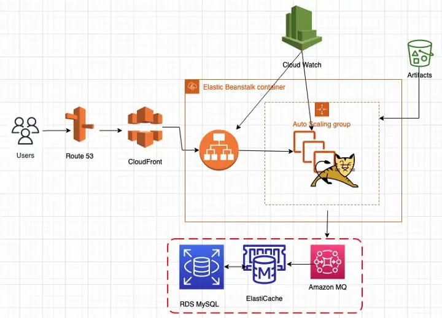

## Vprofile Project 04
# Re-Architecting Web App on AWS Cloud[PASS & SAAS]

[Project Source](https://github.com/devopshydclub/vprofile-project/tree/aws-LiftAndShift)

Prerequisites:
* AWS Account 
* Maven
* JDK8
* AWS CLI

Project architecture;


### STEP 1
Create a `keypair`


### STEP 2
Create a `security group` for the backend services with the following inbound rules shown below;


### STEP 3
Create the MySQL server using `Amazon RDS`. Kindly follow the steps below;
* Create a subnet group for the amazon RDS as shown below;


* Create a parameter group for the RDS;


* Then, create the RDS with the following parameters below;
  1. Select Mysql as shown in the image below; amazon aurora is also a good option, but for this project, we'll be going with mysql
  
  2. Select MySQL v5 as this is recommended for the java application for this project while selecting the Dev/Test template.
  
  3. Select the Multi-AZ, your instance name should be the DB-instance identifier then create the database credentials. Kindly save this credentials as this would be needed in the subsequent steps.
  
  4. Select a burstable class db with `db.t3.micro`
  
  5. Select the `default vpc` and the `subnet group` created earlier
   
  6. Select the backend security group created in the previous `step 2`
    
  7. Enable the enhanced monitoring and create a database account. As shown below, a database with the name `account` was created.
   
  8. Enable automated backups.
   
  9. Enable the preferred log types to be exported to cloudwatch for continous monitoring
   
  10. Create your RDS instance. NOTE: Copy your credentials.
   
### STEP 4
Create the memcached instance using Amazon ElastiCache for memcached clusters. Kindly follow the steps below;
* Create a parameter group for the Elasti Cache
  
* Create a subnet group for the Elasti-Cache
 
* Select memcache clusters to create the memcache instance, select the cluster to be created on AWS, then give the cluster name as shown below;
   
* Select the version, port, parameter group and the node as shown below for this project.
   
* Select the subnet group that was created in the previous step.
   
* Select the backend secutity group created in step 2
  
* Then Create the memcached instance.
 

### STEP 5
Create the `rabbit mq` with `Amazon MQ`. Kindly follow the steps below;
* Select the rabbit mq broker.
  
* Select the following configuration for the rabbit mq instance.
  
  

### STEP 6
Initialize the RDS database created in step 3.
* Allow port `3306` in the backend security group created in `step 2` for access to the MySQL database
   
* Create an ec2 instance to for the initialization, and Install mysql client.
  ```sh
      #!/bin/bash 
      sudo apt update
      sudo apt instal mysql-client -y
  ```
*  Login to MySQL and verify the `account` database created using the RDS endpoint.
   
* Clone the source code of the application, change the branch to `aws-Refactor`, then cd to the `/src/main/resources/` then initilize the database as seen below;
  
* Login to the `account` database to verify the initialization.
  

### STEP 7
Copy the database end points which would be needed for the Elastic Beanstalk.
* RDS endpoint
  
* RabbitMQ endpoint
  
* Elasticache endpoint
  

### STEP 8
Create the application in Elastic Beanstalk.
* Create application, select managed platform and the tomcat service as the java application would be running on tomcat.
     
* Select the `configure more option`, select the security group created in step 2.
    
* Modify the capacity with the credentials below;
    
* Modify the rolling updates
    
* Modify the security
    
* Create the application. This would take a few minutes before the application and its environment is `ok`.
    
    


### STEP 9
Add additional rules to the backend security group to allow access from the Elastic Beanstalk Security Group. A security group would be created automatically for the Elastic Beanstalk.
  

### STEP 10
Validate the application with the Elastic Beanstalk endpoint.

